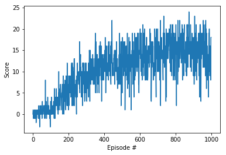
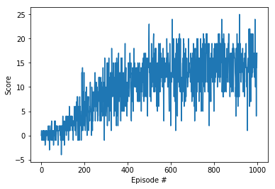

# Udacity Deep Reinforcement Learning - Project 1

## Project Summary

For this project, I used a Deep Q-Network to train the agent whose task was to collect yellow bananas and avoid blue ones. A reward of +1 is provided for collecting a yellow banana, and a reward of -1 is provided for collecting a blue banana.

## DQN Model

In this case, I wanted to see how changing the number of neurons in the hidden layer would affect the model. So I trained two models of four layers, one with 64 neurons in the hidden layer and one with 128 neurons. 

Surprisingly, the model with 64 neurons was able to achieve a score of 13 in just 481 episodes whereas it took the model with 128 neurons 673 episodes. The rest of the hyper-parameters were the same as the ones used in DQN class. The network uses a batch size of 64 examples and a learning rate of 0.0005. The agent updates the target Q-network every 4 steps using a discount factor of 0.99.

### Score vs Episodes for model with 64 neurons

### Score vs Episodes for model with 128 neurons

## Future Work

There are plently of changes that can be implemented. For example, the number of neurons can be increased even more. This might lead to longer training times, but the network could become more stable and acheive higher scores. Also, Duelling DQN and Double might achieve better results.
