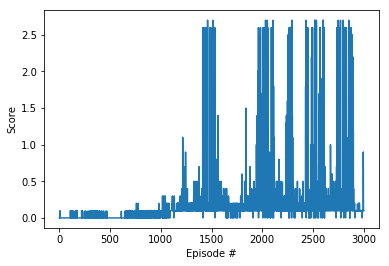

# Project report

## Introduction

The goal of this project is to train two agents to control two rackets and keep a ball in play for as long as possible. If an agent hits the ball over the net, it receives a reward of +0.1.  If an agent lets a ball hit the ground or hits the ball out of bounds, it receives a reward of -0.01.  Thus, the goal of each agent is to keep the ball in play.

The task is episodic, and in order to solve the environment, your agents must get an average score of +0.5 (over 100 consecutive episodes, after taking the maximum over both agents). Specifically,

The environment is considered solved, when the average (over 100 episodes) of those **scores** is at least +0.5.

## Environment

The observation space consists of 8 variables corresponding to the position and velocity of the ball and racket. Each agent receives its own, local observation.  Two continuous actions are available, corresponding to movement toward (or away from) the net, and jumping. 

### MADDPG architecture
I found MADDPG environment quite interesting as I wanted to work with multi-agent environments for quite some time. However, the reason for sticking to MADDPG was tme constraint. The code is very similar to to my previous projects which is based on the DDPG-Pendulum exercise. The training of multi-agent is quite tricky as it requires training two seperate agents which need to collaborate with each other (kind of similar to GANs?).  
 
My final network for both actor and critic consisted of:
- Fully connected layer - input: 87 (state size) output: 256
- Fully connected layer - input: 256 output 256
- Fully connected layer - input: 256 output: 2 (action size)

The agents were easily able to solve the task after 1514 episodes only. 

## Next Steps

Due to time constraints, this seemed to be the easiest approach. However there are quite a few ideas that I would like to pusue in the future. For example, I would like to implement Multi Agent Proximal Policy Optimization (MAPPO) and see how it fares against MADDPG. Also, the choice of random_seed greatly affects how quickly the model learns so I would like to explore in that direction as well. EVen including prioritized replay might help reaching higher scores. 
